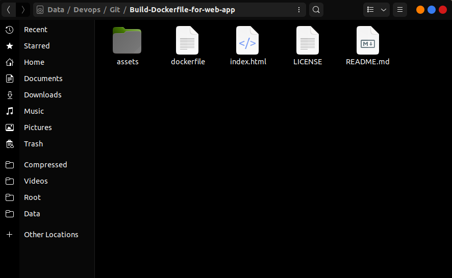
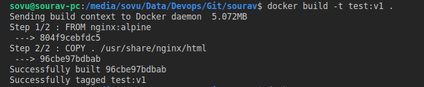
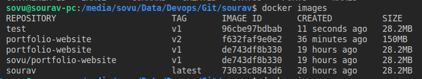

# Build a Dockerfile of your Own web application

In this project, I used my Portfolio web application as a webpage and then I create a dockerfile to build the docker images.
These are the step you need to flow to do so

### Step 1

Make a web page you can make it by yourself or you can download it.
Once you are ready with the web pages or website we can move to the next step

> Make sure all the files and images are in one folder if any on your web page
> 

### Step 2

Now Create a dockerfile with the name

```
dockerfile
```

and make sure there is no

```
.
```

extension like

```
.txt
```

It has to be in the same folder where your webpage is there as shown in the below image



### Step 3

Now we will write Code for the dockerfile

```
FROM nginx:alpine
COPY . /usr/share/nginx/html

```

Just copy this code into your `dockerfile`

### Step 4

Now Open the terminal or CMD in that same location

```
docker build -t test:v1 .

```

Run this command to build the docker images.

```
-t
```

is a flag that will give the image name

```
test
```

is an image name

```
v1
```

is a tag of the image



### Step 5

Now the docker image is build you can see your image by running the command

```
docker images

```



### Step 6

Now let's run the image that we just created with a dockerfile which has your webpage init.

```
docker run -d -p 80:80 <image ID / image name>:tag

```

- `d` it means it will run detach mode. The docker cotainer runs in the background of your terminal.
`p` it means we have to give the post to the host and container so the first 80 is for the host and the next 80 is for the docker container

Now if everything is working then you will be able to run your webpage.

### Step 7

Open the Browser of your choice then write `localhost:80` in your browser address bar and press enter, WOW your website is running
